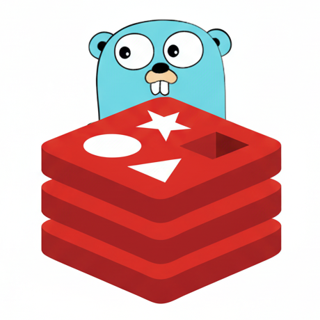

# MemKV - A Redis-Inspired In-Memory Database

MemKV is a high-performance, in-memory key-value database built from scratch in Go.
It is inspired by Redis and implements the **RESP (Redis Serialization Protocol)**, making it fully compatible with redis-cli.

This project was built for educational purposes to explore high-performance network servers, custom data structures, and the low-level design of modern databases.

## Key Features
- **Redis Protocol (RESP) Compliant**: Fully compatible with redis-cli and other Redis clients.

- **High-Performance I/O**: Uses a single-threaded, event-loop architecture with I/O multiplexing (epoll for Linux and kqueue for macOS) to handle thousands of concurrent connections.

- **Custom Data Structures**: Implements complex data structures from scratch, including:
  - Skip List: For high-performance sorted sets (ZADD, ZRANK, etc.).
  - Geohash: For efficient geospatial indexing (GEOADD, GEODIST, etc.).

- **Probabilistic Data Structures**: Includes implementations of:

  - **Scalable Bloom Filter**: For fast, memory-efficient set membership testing (BF.ADD, BF.EXISTS).

  - **Count-Min Sketch**: For estimating item frequencies in a data stream (CMS.INCRBY, CMS.QUERY).

- **Graceful Shutdown**: Ensures data is handled correctly and connections are closed properly on server termination.
  
## Getting Started
```
  cd cmd
  go run main.go
  # on another terminal
  redis-cli -p 8081
```
## 🛠️ Supported Commands

The server supports a wide range of commands grouped by data type:

| Category | Commands |
| :--- | :--- |
| **General** | `PING` |
| **String** | `SET`, `GET`, `DEL`, `TTL`, `EXPIRE`, `INCR` |
| **Sorted Set**| `ZADD`, `ZRANK`, `ZREM`, `ZSCORE`, `ZCARD` |
| **Set** | `SADD`, `SREM`, `SCARD`, `SMEMBERS`, `SISMEMBER`, `SRAND`, `SPOP` |
| **Geospatial** | `GEOADD`, `GEODIST`, `GEOHASH`, `GEOSEARCH`, `GEOPOS` |
| **Bloom Filter**| `BF.RESERVE`, `BF.INFO`, `BF.MADD`, `BF.EXISTS`, `BF.MEXISTS` |
| **Count-Min** | `CMS.INITBYDIM`, `CMS.INITBYPROB`, `CMS.INCRBY`, `CMS.QUERY` |

## Future Work
[ ] Hyperloglog

[ ] Morris counter

[ ] Cuckoo filter

[ ] Approx LRU eviction

[ ] Approx LFU eviction

[ ] Longest Common Subsequence
